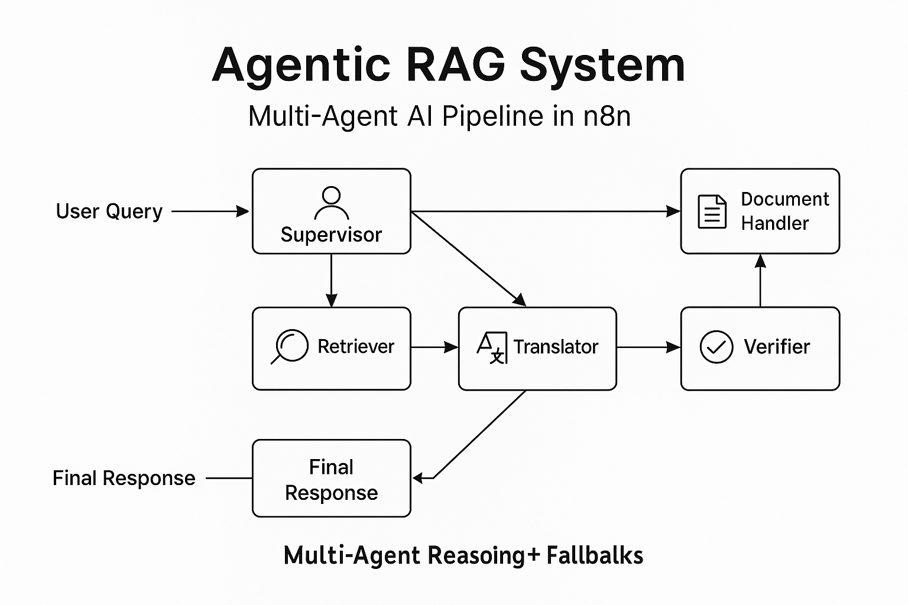
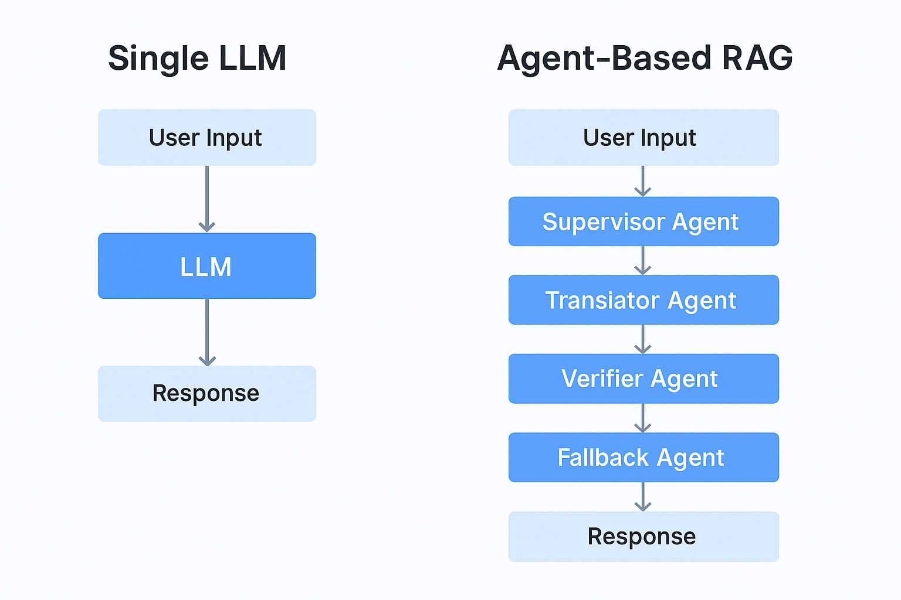

# Sentinel: Autonomous Multi-Agent Reasoning & RAG Engine

> **Project Pitch:**  
> As a developer based in **Ethiopia**, I see how complex data retrieval challenges slow down local and global businesses. I built **Sentinel** to go beyond simple search—it thinks, reasons, and double-checks like a smart research assistant.  
> It breaks user questions into parts, routes each part to the right domain expert agent, and combines the outputs into high-quality, verified answers.  
> **My goal:** To solve the problem of information overload and inaccurate AI responses by building intelligent, multi-agent reasoning systems.

---

## 📊 System Diagram

This workflow uses intelligent agent routing and fallback mechanisms:

---

## What It Does  
- Breaks complex questions into smaller sub-questions
- Routes each sub-question to the best domain expert agent using metadata and glossaries
- Pulls from multiple retrieval sources (knowledge bases, vector stores)
- Synthesizes final answers, checking consistency and completeness
- Uses a Supervisor Agent to manage the conversation intelligently and autonomously

- ## 🖼️ Visual Comparison: Agentic RAG vs. Single LLM

This side-by-side shows how agent-based architecture distributes tasks intelligently, while a single LLM must handle everything in one shot.

---

## Technologies Used
- n8n (workflow orchestration)
- OpenAI GPT models via LangChain
- Vector search with Pinecone or Weaviate
- Metadata filtering and glossary matching
- Agentic orchestration strategies (Supervisor Agent, Specialist Agents, Follow-up Question Generation)

---

## Files
- **agentic-rag-system-workflow.json** — The exported n8n workflow file
- **agentic-rag-system-diagram.png** — Visual flow diagram of the system

---

## Why This Matters
This project solves a critical problem: **the unreliability of standard AI responses.** In many regions, including Ethiopia, access to high-quality, context-aware information is a bottleneck. 
This project demonstrates how modern AI systems can go beyond simple question-answering—building agentic, multi-step, self-verifying reasoning flows that ensure higher quality, domain-specific answers.  
It shows practical AI orchestration skills that can be applied to real business problems, from automated customer support to deep research tools.

---

## 👨‍💻 About the Developer
**Esubalew**  
*AI Agent & Automation Expert*  
📍 Based in Ethiopia  

I am passionate about leveraging AI and automation (n8n, LangChain, Python) to solve complex problems and create efficient digital systems. This project is part of my portfolio as an AI Agent Implementation Manager.

---

## Future Work

- Implement a dynamic Supervisor Agent that adapts its aggregation logic based on domain-specific metadata
- Integrate document freshness scoring to prioritize recent information retrieval
- Add an automated retraining system to update the domain experts based on new data
- Deploy a monitoring dashboard to track agent performance, answer latency, and user satisfaction
- Build an agent evaluation dashboard for performance benchmarking

---
*Developed by Esubalew - Ethiopian AI Solutions Portfolio.*
